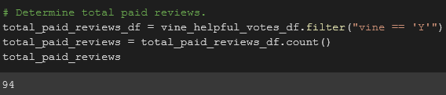
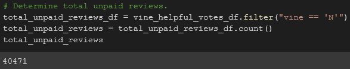
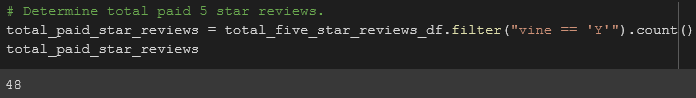
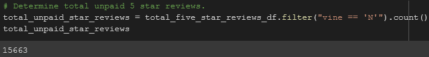
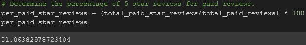
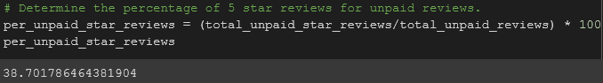

# Amazon Vine Analysis

## Project Overview
The SellBy stakeholders want an analysis on Amazon reviews written by members of the paid Amazon Vine program. One of the fifty databases is to be chosen and find if there is any positivity bias for the reviews in the Vine program.

1. Pick a database and use PySpark to perform the ETL process to extract the dataset, transform the data, connect to the AWS RDS instance, and load the transformed data into pgAdmin.
2. Use PySpark to find out if there is any bias towards favorable reviews from Vine members.

## Resources
- Data Sources: [Amazon Game Reviews](https://s3.amazonaws.com/amazon-reviews-pds/tsv/amazon_reviews_us_Video_Games_v1_00.tsv.gz)
- Software: Google Colab Notebook, Amazon Web Services, pgAdmin 4, PostgreSQL 13

## Results
 

- There were 94 Vine reviews and 40,471 non-Vine reviews.

- There were 48 5 star Vine reviews and 15,663 5 star non-Vine reviews.

- The percentage of Vine reviews that were 5 stars was 51.06% and the percentage of non-Vine reviews that were 5 stars was 38.70%.

## Summary
There is positivity bias for the reviews in the Vine program for the simple fact that the sample group from which we did the analysis on is smaller for the 5 star Vine reviews out the total Vine reviews in comparison to the sample group for 5 star non-Vine reviews out of the total non-Vine reviews. To provide additional analysis we could look at the mean, median, variance, and standard deviation to further determine whether a bias is present.
